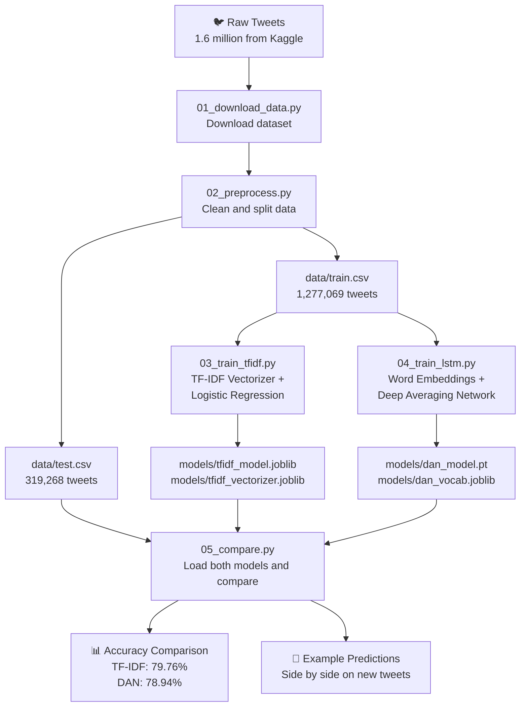

```mermaid
flowchart TD
    A[🐦 Raw Tweets\n1.6 million from Kaggle] --> B[01_download_data.py\nDownload dataset]
    B --> C[02_preprocess.py\nClean and split data]
    C --> D[data/train.csv\n1,277,069 tweets]
    C --> E[data/test.csv\n319,268 tweets]

    D --> F[03_train_tfidf.py\nTF-IDF Vectorizer +\nLogistic Regression]
    D --> G[04_train_lstm.py\nWord Embeddings +\nDeep Averaging Network]

    F --> H[models/tfidf_model.joblib\nmodels/tfidf_vectorizer.joblib]
    G --> I[models/dan_model.pt\nmodels/dan_vocab.joblib]

    E --> J[05_compare.py\nLoad both models and compare]
    H --> J
    I --> J

    J --> K[📊 Accuracy Comparison\nTF-IDF: 79.76%\nDAN: 78.94%]
    J --> L[📝 Example Predictions\nSide by side on new tweets]
```